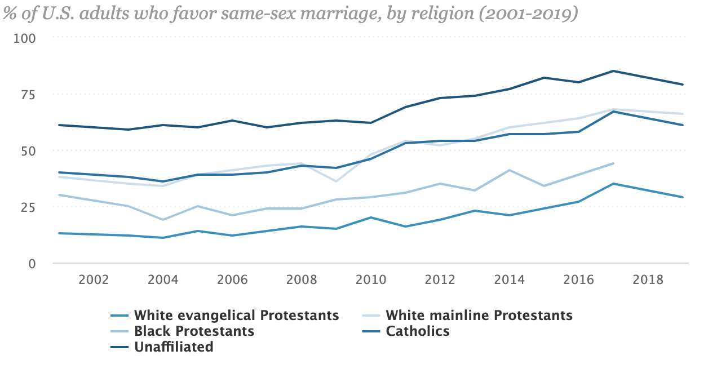

```{r setup, include=FALSE}
knitr::opts_chunk$set(echo = TRUE)
library(tidyverse)
require(ggplot2)
require(directlabels)
require(plotly)
require(dplyr)
```


## Overview

URL: https://www.pewforum.org/fact-sheet/changing-attitudes-on-gay-marriage/

Image:



The visualization I am looking to replicate is a line graph which shows yearly proportions of support for same-sex marriage. Each graphed
line represents a denomination. The study in question looked at a few different demographics to determine the opinions of same-sex marriage
support, whether it be ethnicity, political party, or as I'm looking at here, religious affiliation. The main claim the study makes is 
that those unaffiliated with the church have the highest support for same-sex marriage, with other christian denominations having less 
support. Based on the study done, throughout the years the acceptance for gay marriage has gone up. 

## Design

Given that the graph is showing a trend over time, the author uses a line graph to show the trend of support of gay marriage across the
church. The variables being shown are year on the x-axis and percent acceptance on the y-axis. Each line represents a religious affiliation,
more specifically, a Christian affiliation. The lines on the graph are fairly thin and are all a different shade of blue. The years are
spaced out by two. There are faint dashed lines for each threshold on the y axis as well. To comment on a particular retinal variable, I 
think that the lines could have had different colors since the categories are fairly distinct. I personally use hue variation a lot more 
often when there are ranges of numbers with some order to them rather than categorical variables (ex, a range of numbers for elevation when
mapping, like 600-699, 700-799, etc). Overall I think the design is good though and I think it's simplicity makes it very effective. It
isn't trying to do too much and the creator knew this data was generally straightforward and didn't try and cram many different variables
in it. 

## Dataset

This data is from pewreasearch.org, found here https://www.pewforum.org/fact-sheet/changing-attitudes-on-gay-marriage/ . I was able to find
the original data and it was embedded into the article so I took the data from there and copy and pasted it into google sheets and saved it
as a csv for easier use. I did not change anything just to make sure I practice techniques of data tidying in R. The data was already 
available on the website for use. The main report/study for this data can be found
https://www.pewresearch.org/politics/2019/05/14/majority-of-public-favors-same-sex-marriage-but-divisions-persist/ under "complete report"
in the pane to the right. A team of 9 individuals worked on the research, most notably the Director of Political Research at Pew, Caroll
Doherty, and the associate director, Jocelyn Kiley. The data were constructed in a random sample of 1503 adults 18 or older. All surveys
were done on telephone, and the data they collected were then linked to data of their ethnicity and age from census data. As stated
previously, there were a lot of demographics that were looked at in the survey, like religious affiliation, voting records, generation, and
ethnicity. Also to note, data graphed prior to 2015 was based on yearly average data, though nothing was stated about where that data came
from necessarily. To interpret this graph correctly it is important to keep in mind that this is mainly a survey and although there may be
correct trends that sample populations are not always 100% accurate. Generally its not a bad idea to compute CI's for the proportions 
measured here to statistically test and check the sample method. The split in data collection by year is also something to keep in mind
(since data before 2015 was collected differently in this study).

```{r download-data}


# 
# if (!dir.exists("data"))
#   dir.create("data")
# if (!file.exists(data_filename)) {
#   download.file(url = "https://the-data-url-goes-here",
#                 destfile = data_filename)
# }
```


```{r load-data}
attitudes <- read.csv('https://docs.google.com/spreadsheets/d/e/2PACX-1vTLpPlMP67fmXJl96OcqZZ4lYoVZ4yvn2JlRqIHRUbljnqqNZnbwlWIHWfKSYYa1ba9h2qdk_HzEC1u/pub?output=csv')
head(attitudes)
```

The data is not big, just `r nrow(attitudes)` rows and `r col(attitudes)` columns, with each observation representing a year with
percentages of survey results on attitudes towards gay marriage. The data only provides percentages for the different denominations in 
the study rather than putting all of the categories looked at in one data table. Overall I think it is good that they didn't try and cram
all of the possible variables into one dataset and just kept it thematic to denomination. There are also two years that have been left out
of the survey, 2002 and 2018 most notably. While I don't think this impacts the trends all that much in retrospect, its still an interesting
design choice by the research team. 

## Wrangling

Here, I am looking to make it so that I am able to graph these lines on the same plot. I will need to pivot these so that each row 
represents what a certain denomination's % approval is per year. For easier use I am going to convert the percent values as proportions.

*Add code blocks, with appropriate names, for wrangling steps.*
```{r}


attitudes_pivot <- attitudes %>%
  janitor::clean_names() %>%
  pivot_longer(names_to = "Denomination", values_to = "Proportion_accepted", cols = -year) %>%
  # Removing percentage sign from columns. Logic used from: https://www.rforexcelusers.com/remove-currency-dollar-sign-r/
  mutate(Proportion_accepted = as.integer(gsub("%", "", Proportion_accepted))) %>%
  # make values a proportion. 
  mutate(Proportion_accepted = Proportion_accepted / 100)
```

## Replication

*Vis code goes here*
```{r interactive plot}
p1 <- attitudes_pivot %>%
  mutate(Denomination = fct_relevel(Denomination, "unaffiliated",
                                    "white_mainline_protestants",
                                    "catholics",
                                    "black_protestants",
                                    "white_evangelical_protestants")) %>%
  ggplot(mapping = aes(x = year, y = Proportion_accepted, color = Denomination)) +
  geom_line() +
  labs(y = "Proportion of Same Sex Marriage Acceptance", x = "Year", title = "Percent of adults favoring same-sex marriage 
  by religious affiliation")
ggplotly(p1)
```

```{r labeled plot}
#logic from https://stackoverflow.com/questions/29357612/plot-labels-at-ends-of-lines
p2 <- attitudes_pivot %>%
  mutate(Denomination = fct_relevel(Denomination, "unaffiliated",
                                    "white_mainline_protestants",
                                    "catholics",
                                    "black_protestants",
                                    "white_evangelical_protestants")) %>%
  ggplot(attitudes_pivot, mapping = aes(x = year, y = Proportion_accepted, color = Denomination)) +
  geom_line() +
  labs(y = "Proportion of Same Sex Marriage Acceptance", x = "Year") +
  scale_colour_discrete(guide = 'none') +
  geom_dl(aes(label = Denomination), method = list(dl.trans(x = x - 3.9), "last.points", cex = 0.8)) 
p2
```

I created two plots, one was using my own design choice and the other was a suggestion from Prof. Arnold. In the first one, I wanted to 
replicate the interactivity of the original plot (which doesn't show up in the image I put in here, but it is interactive in the original
article). I used plotly to give the graph this feature. 

For the second plot, I used a different labeling method which was a suggestion from Prof. Arnold, which used the directlabels library to
give labels on the lines on the plot. I wanted to combine the two plots but plotly doesnt support use for directlabels labeling, so this was a slight difficulty I had. 


Similar to the graph from the survey, those unaffiliated with the church have the highest support for gay marriage, with white evangelical
protestants having the lowest acceptance. Since 2004 there has been a fair increase in support for gay marriage among all denominations. 


## Alternative Designs

Two alternative designs I have for this graph are as follows:

- Stacked area chart - keeps the line graph shape and structure but fills in space to easily distinguish which denomination has more
gay marriage support. This redesign doesn't change much about the claim. I think with a line graph more emphasis can be placed on trends,
as with area charts there might be more emphasis on the order of support from highest to lowest. I do think that an area chart can achieve
the same goals as a line graph can, so overall I think this is the best alternative since it is very similar to the line graph. 

- Stacked column chart - this technically can show the change in trends over time so it works in theory, but isn't as readable as a line
graph. It is an alternative choice but it is not really an improvement, where one could argue an area chart is a slight improvement. For
this column chart, each year could be a separate column, and each column would have a fill for the proportion of a denomination's support. 

```{r area chart}
p3 <- attitudes_pivot %>%
  mutate(Denomination = fct_relevel(Denomination, "unaffiliated",
                                    "white_mainline_protestants",
                                    "catholics",
                                    "black_protestants",
                                    "white_evangelical_protestants")) %>%
  ggplot(mapping = aes(x = year, y = Proportion_accepted, fill = Denomination)) +
  geom_area() +
  labs(y = "Proportion of Same Sex Marriage Acceptance", x = "Year", title = "Percent of adults favoring same-sex marriage 
  by religious affiliation")
ggplotly(p3)
```

```{r column chart}
p4 <- attitudes_pivot %>%
  mutate(Denomination = fct_relevel(Denomination, "unaffiliated",
                                    "white_mainline_protestants",
                                    "catholics",
                                    "black_protestants",
                                    "white_evangelical_protestants")) %>%
  ggplot(mapping = aes(x = year, y = Proportion_accepted, fill = Denomination)) +
  geom_col() +
  labs(y = "Proportion of Same Sex Marriage Acceptance", x = "Year", title = "Percent of adults favoring same-sex marriage 
  by religious affiliation")
ggplotly(p4)
```


## Summary:

The main reason I picked this graph and data to look at in the first place was because of my interest in religion and politics. I've always
been really intrigued by how people interpret the Bible for their respective denomination. I think one way to effectively see how people
interpret the Bible is by studying how they feel about gay marriage. It is a pretty controversial topic among Christians, since the Bible 
does renounce gay marriage, but many people justify a biblical support for gay marriage by using God's teachings of love and respect for
others, even those who may have a different worldview. 

I honestly think Pew did a great job with this study, and I was even more impressed when I was beginning to create visualizations of my own
based on this data. As a data scientist, there's a lot more excitement in working with data ourselves, rather than just reading studies. 
It definitely made me appreciate the choices in design and sampling that were made much more than if I just happened to come across it
online. When I first came across the article, I was slightly skeptical of how the data was collected, and I feel like on the article itself
it was vague on how Pew came up with the numbers they did. However, after reading the methodology of the study and seeing firsthand how
it was done, I felt much less skeptical and understood the study much more. As far as the claim goes, the main claim was that those
unaffiliated with the church supported gay-marriage the most with white evangelicals supporting it the least. My understanding and belief of
this claim didn't really change all that much, as I anticipated from the get go that the proportions seemed pretty accurate and believable. 

I think the replication was pretty faithful given that the main things I took away from it were its simplicity and its interactivity. 
These are things I considered and practiced when doing the replication graph. The only main thing I changed was the color scheme, which I 
did purposefully, and might be my only critique of the original graph. The alternative designs do work, although I think using a line graph
is still probably better for this data. With all of the plots specifically, there is some problem with missing data, and the line and area
charts both clean this up more than the column chart which is missing two years. 

An idea I have with this dataset is to incorporate religions more specifically. I think this would be really interesting if they were able
to randomly sample a handful of different religions along with Christianity and compare % support. I also think it would be interesting
to measure the support of transgenderism across different religions. For a final project this might not be a bad thing to look into, as I
could do a more in-depth study researching Christianity and the LGBTQ community. This is sort of vague because I am not sure what I want
to do yet for my final project. I do think there is room for statistical modeling in studying this, though, so it is a possibility. 

Like I said above, I think the experience was very interesting and exciting. I've grown to really enjoy working with data, as I was
undecided and unsure of what I wanted to do for the rest of my life going into college. This is the first time in one of my classes I have 
been able to look at and replicate graphs that real data scientists and statisticians made. I think I've slowly progressed to appreciate the
field of data science more and more since my freshman year, and there is definitely still much more to learn. 
